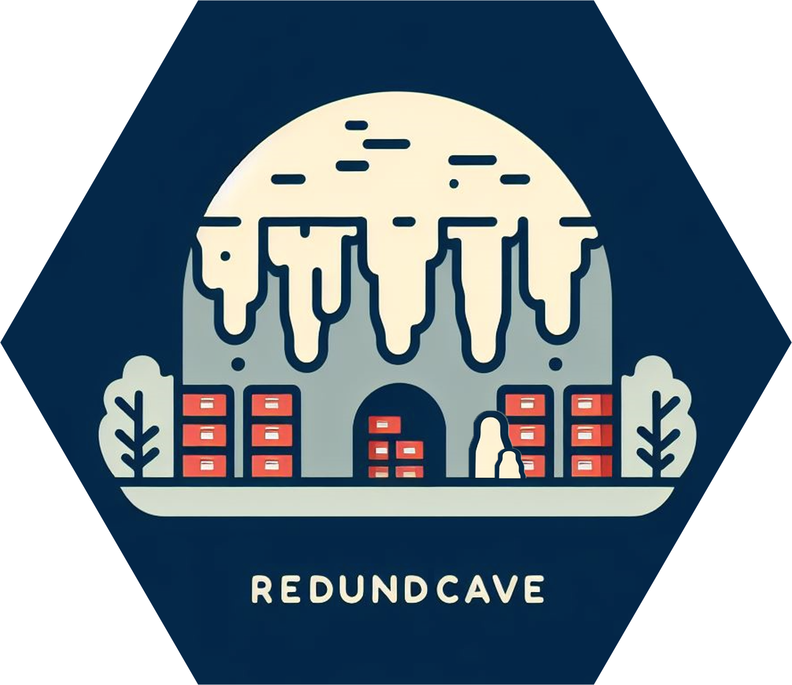

<h1 align="center">
   
  </a>
   
  RedundCave : United in Protecting Every Bit.
   
  
溶洞 : 共同守护每一比特.

</h1>

Peer-to-Peer Heterogeneous Redundancy Storage

## What is RedundCave?

The “RedundCave” project aims to fully harness the potential of peer-to-peer networks by utilizing heterogeneous redundancy and edge storage technologies, providing robust security for user data. In this system, each user serves not only as a data storage node but also as a vital contributor to the overall network operation, enabling data to flow freely across a vast network of devices.

## Documentation

- [RedundCave Whitepaper](docs/WhitePaper_zh-CN.md)