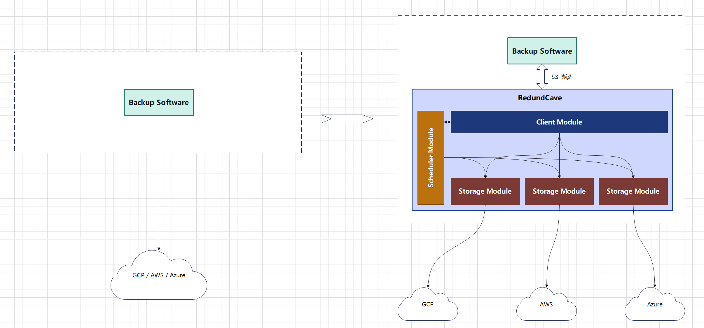
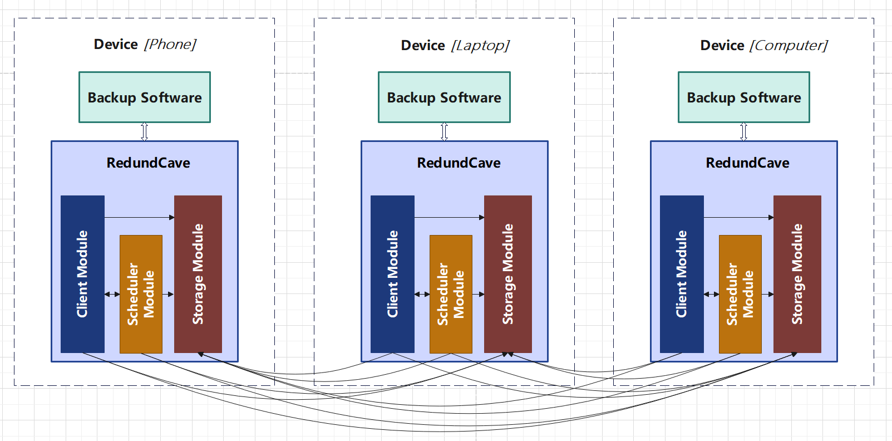
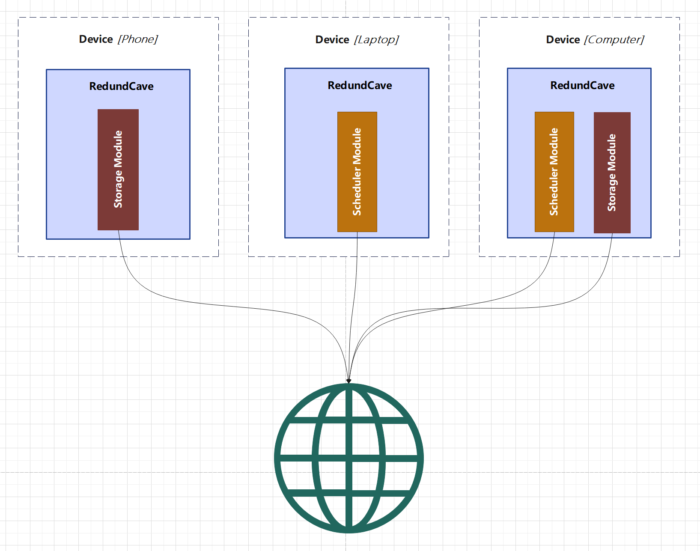
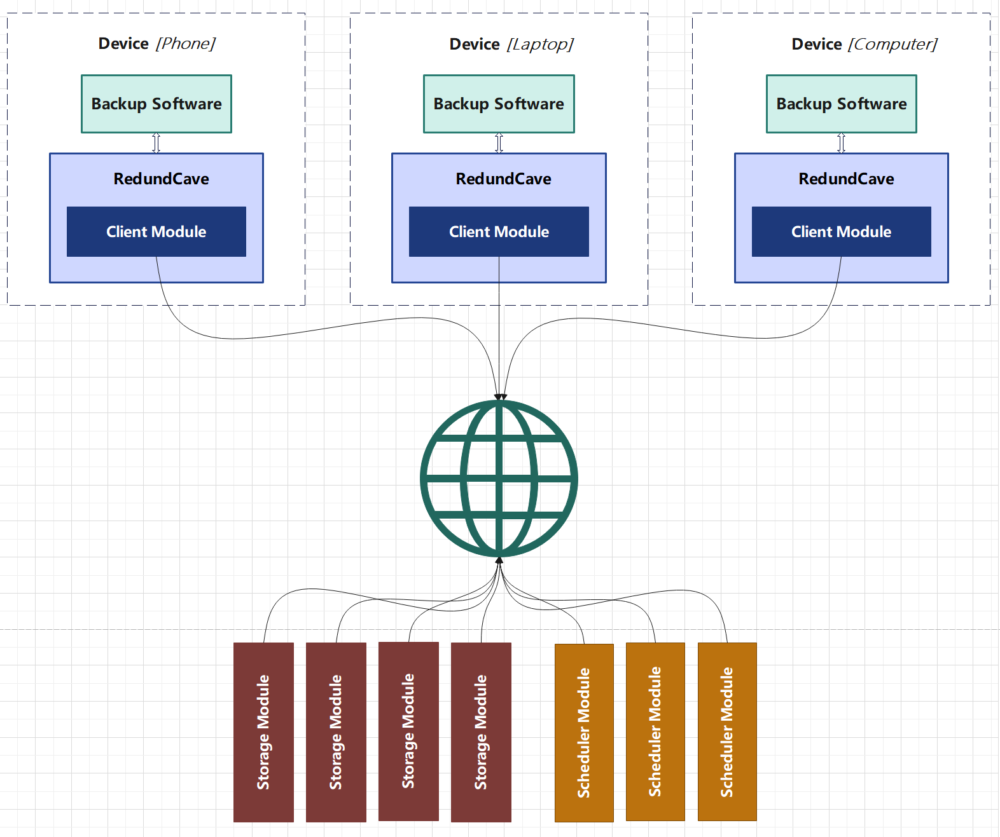

## 引言

在数字化生活和工作的普及下，个人数据量正在快速增长，如社交媒体信息、电子邮件、照片、视频、购物记录、健康数据等。
数据的安全性、移动性、社交与共享需求以及个性化存储需求也在日益增长。
与此同时，随着技术的快速发展，个人终端设备（如智能手机、平板电脑、个人电脑等）拥有强大的计算、存储等资源，但这些资源目前并未被充分利用。

我们的目标是构建一个存储空间交易平台，该平台将开放源代码以实现可持续发展，存储配置简单灵活，存储接口易用性强。
该平台将具有服务高可用，数据可靠性高，数据隐私性强等特点。
让每一个用户都能享受到安全、便捷、高效的存储服务。

## 背景
### 个人数据的种类有哪些?
个人数据是指与个人相关的数据信息。以下是一些主要的个人数据类型：

1. **图像和视频数据**：这包括个人拍摄的照片和视频，例如家庭聚会的照片或者旅行的视频。此外，也包括下载的图片和视频，例如从网上下载的电影或者动漫。

2. **音频数据**：这包括音乐，播客，以及语音记录。例如，在音乐应用中收听的歌曲，订阅的播客，以及使用语音助手时的语音指令。

3. **文本数据**：这包括文档，邮件，以及笔记。例如，在工作中编写的报告，与朋友和同事的电子邮件往来，以及在笔记应用中记录的想法和待办事项。

4. **应用数据**：这包括应用程序的设置和数据，软件配置文件，以及游戏存档。例如，在社交媒体应用中的个人设置，电脑上软件的配置文件，以及在游戏中的进度和成就。

5. **个人信息**：这包括身份信息，健康信息，行踪信息，以及口令信息。例如，姓名，出生日期，医疗记录，GPS位置数据，以及用于各种账户的用户名和密码。

6. **行为数据**：这包括网络浏览历史，购物记录，以及社交网络活动。例如，在网上浏览的网页，在电商平台上的购买记录，以及在社交媒体上的点赞，评论和分享。

### 个人数据有哪些价值?

个人数据的价值多种多样，可以从以下几个方面来理解：

1. **个人使用价值**：个人数据对于个人来说有着重要的价值。例如，照片和视频可以帮助我们保存珍贵的记忆，音乐和播客可以为我们提供娱乐或教育的价值。

2. **商业价值**：对于企业和组织来说，个人数据可以用于市场分析、产品开发和广告定位，从而提高其服务的相关性和吸引力。例如，通过分析用户的购物记录和网络浏览历史，企业可以更准确地了解用户的需求和喜好。

3. **研究价值**：研究人员可能使用个人数据来进行社会科学、医学、行为经济学等领域的研究。例如，医学研究人员可能会利用健康信息来研究疾病的发展和治疗方法。

4. **安全与合规**：应用数据和个人信息对于确保软件和服务的安全运行至关重要。例如，身份信息和口令信息可以保护用户的账户安全，软件配置文件可以帮助提供个性化的用户体验。

5. **公共服务价值**：政府机构可能会利用行踪信息和健康信息来提供公共服务，如流行病监测、城市规划等。例如，通过分析大量用户的行踪信息，政府可以更有效地进行城市规划和交通管理。

6. **社交价值**：社交网络活动数据可以用于分析社会趋势、公众意见，甚至可以用于灾难响应和应急管理。例如，通过分析社交网络上的公众舆论，政府和组织可以更好地了解公众的需求和期望。

### 目前个人数据的存储方式 & 解决的问题 & 弊端

个人数据的存储方式多种多样，每种方式都有其解决的问题和存在的弊端：

1. **本地存储**
    - **设备内置存储**
        - 例子：如智能手机、平板电脑、个人电脑的内部硬盘或固态硬盘。
        - 优点：提供快速的数据访问速度，不依赖网络连接，可以在离线状态下使用。数据控制权完全在用户手中，不需要担心数据隐私和安全性问题（除非设备本身被盗窃或损坏）。
        - 弊端：存储容量受限于设备本身，可能需要定期更换或升级设备。数据备份和恢复过程可能较为复杂和耗时。设备损坏或故障可能导致数据丢失。
    - **外部存储设备**
        - 例子：包括USB闪存驱动器、外部硬盘、SD卡等可移动存储介质。
        - 优点：提供了额外的存储空间，便于数据的携带和分享。
        - 弊端：易丢失，数据安全性较低。

2. **云存储服务**
    - **公共云服务**
        - 例子：如阿里云、腾讯云、华为云、百度云等提供的云端存储空间。
        - 优点：提供大容量的存储空间，可扩展性强。方便实现数据的跨设备同步和共享。数据通常会有多重备份，提高数据的安全性。
        - 弊端：数据安全和隐私问题严重，服务可靠性有待提高，用户可能对云存储服务产生过度依赖，成本可能较高，数据迁移和锁定问题突出，合规性和法律问题复杂，性能和带宽受限。
    - **私有云服务**
        - 例子：企业或个人搭建的私有云存储解决方案，如 NAS（网络附加存储）。
        - 优点：提供了自定义的存储解决方案，数据控制权在用户手中。
        - 弊端：搭建和运维成本较高。

3. **第三方应用和服务**
    - **电子邮件服务**
        - 例子：如QQ邮箱、163邮箱等提供邮件存储空间。
    - **专业存储服务**
        - 例子：如专门的照片和视频托管服务、音乐和播客平台。
    - **社交媒体平台**
        - 例子：如微信、微博、抖音等存储用户的图片、视频、文本等信息。
    - 优点：专用的平台可以提供更专业的功能和服务，方便用户在特定领域内存储和共享数据，通常提供用户友好的界面和便捷的操作体验。
    - 弊端：数据可能受到平台政策和服务条款的限制，平台关闭或服务停止可能导致数据丢失或访问困难，可能存在数据隐私和安全性问题。

### 利用终端设备的闲置资源具备哪些条件?

要利用终端设备的闲置资源，需要满足以下几个条件：

1. **个人终端设备性能不断增加**：随着技术的快速发展，个人终端设备（如智能手机、平板电脑、个人电脑等）拥有强大的处理能力、存储空间等资源。例如，现代智能手机的处理能力已经超过了早期的台式电脑，而且存储空间也在不断扩大。

2. **个人终端设备在线率高**：在当今社会，个人终端设备几乎始终保持着在线状态。这得益于无线网络技术的普及和移动数据服务的广泛覆盖。用户可以随时随地通过设备接入互联网。例如，许多人在出行、休息、等待等场合都会使用手机上网，这使得设备的在线时间大大增加。

3. **个人终端设备多元化**：随着科技的发展，人们越来越多地拥有多种设备，包括智能手机、平板电脑、笔记本电脑、智能手表等。这些设备在不同的场景和用途中发挥着各自的作用，从而增加了设备的使用时间和频率。例如，一些人可能在工作时主要使用电脑，而在通勤或休息时则主要使用手机或平板电脑。

4. **个人终端设备使用的非均匀性**：在数字化生活中，人们通常拥有多种设备，如智能手机、平板电脑、笔记本电脑等。然而，这些设备的使用并不均匀。例如，一些设备可能主要在工作时间或特定的娱乐场景中使用，而在其他时间，如夜间或非工作日，这些设备可能大部分时间处于闲置状态。这种现象揭示了大量的计算和存储资源在大部分时间内并未被充分利用，这为利用这些闲置资源提供了可能性。

### 共享存储已有的探索

在共享存储领域，已经有一些项目进行了探索，例如 Filecoin 和 Storj。这些项目都试图通过利用闲置的存储资源来创建一个去中心化的存储网络。

1. **Filecoin**：Filecoin 是一个基于IPFS协议的去中心化存储网络。用户需要支付 Filecoin 代币才能访问存储服务，而提供存储服务的节点将获得 Filecoin 代币作为报酬。

2. **Storj**：Storj 是一个开源的云存储市场、协议和激励层。它使用全球网络的节点来分发和保护数据，并且与各种平台具有 S3 兼容性和集成。

尽管这些平台都在尝试利用用户未使用的存储空间，但在实际操作中，用户参与的门槛仍然较高。对于普通用户来说，加入这些网络并共享存储资源需要一定的技术知识和操作能力。此外，目前这些平台的资源利用率相对较低。许多用户可能并未充分使用他们所共享的存储空间，导致资源浪费。

在冗余分布方面，现有的平台往往采用固定的冗余机制，用户无法根据自身需求调整冗余程度。此外，用户在存储数据时，无法根据数据的重要性或访问频率进行分层存储，这可能影响数据的整体存储效率和成本。

因此，尽管 Filecoin 和 Storj 等项目在共享存储领域进行了一些探索，但仍存在许多未解决的问题和挑战。

### 共享存储的发展有哪些挑战?

1. **数据安全和隐私**：在共享存储环境中，数据安全和隐私保护是首要关注的问题。必须确保只有授权用户才能访问特定的数据，并且数据在传输和存储过程中得到充分的加密和保护。

2. **数据一致性和完整性**：在多个用户或系统同时访问和修改数据的情况下，保持数据的一致性和完整性是一个挑战。需要实现有效的并发控制和数据同步机制。

3. **性能和可扩展性**：随着用户数量的增加和数据量的增长，共享存储系统需要提供高性能和可扩展的解决方案，以满足不断增长的需求，同时保持稳定的性能。

4. **访问控制和权限管理**：管理多个用户和系统对存储资源的访问权限是一项复杂的任务。需要实现细粒度的访问控制机制，以确保每个用户只能访问他们被授权访问的数据。

5. **数据共享和协作**：促进不同用户和系统之间的数据共享和协作是一个挑战。需要提供简单易用的接口和工具，以支持数据的共享、协作和交换。

6. **法律和合规性问题**：不同国家和地区有不同的数据保护法律和规定，共享存储服务需要遵守这些法律，确保数据的合法合规使用。

7. **成本管理**：共享存储系统的建设和维护需要考虑成本问题。需要平衡成本和性能，提供经济高效的存储解决方案。

8. **技术标准化**：目前共享存储领域缺乏统一的技术标准，这导致不同厂商和解决方案之间的兼容性问题。需要推动行业标准的制定和实施。

9. **数据迁移和互操作性**：用户可能需要将数据从一个共享存储系统迁移到另一个系统，这要求系统之间具有良好的互操作性，以便于数据的迁移和集成。

## 解决方案概述
### 必要的特性

1. **服务可用性**：确保平台服务持续稳定，能够在任何时间、任何地点为用户提供高效、可靠的服务。 如果服务不可用，那么用户将无法存储或检索数据，这可能会对他们的业务产生严重影响。

2. **数据可靠性**：这是确保用户数据不会丢失或损坏的关键。数据是任何业务的生命线，因此保障用户数据在存储、传输和处理过程中的完整性、一致性和正确性至关重要。

3. **数据隐私性**：这是保护用户数据不被未经授权的第三方访问的关键。在今天的数字化世界中，数据隐私和安全性是用户最关心的问题之一。

4. **代码安全性**：这是防止恶意攻击和保护平台安全的关键。开源代码需要经过严格的安全审查和测试，确保平台代码的安全性和可靠性，防止潜在的安全漏洞。

5. **易用性**：这是确保用户可以轻松使用和理解存储服务的关键。一个易用的接口和清晰的文档可以大大提高用户的满意度和生产力。良好的用户体验可以提高用户满意度和留存率.

6. **法律合规性**：遵守法律法规不仅是法律要求，也是维护用户信任和避免法律诉讼的关键。合规性可以帮助平台避免因违规而遭受的财务和声誉损失。

7. **开放性**：这是鼓励创新和透明度的关键。开源代码可以被任何人查看和修改，这可以加速产品的改进和创新。

8. **避免供应商锁定**：供应商锁定会限制用户的选择和灵活性。避免锁定可以提高用户对平台的信任，并允许他们在必要时轻松迁移到其他服务。这可以防止用户被迫使用他们不满意的服务。

9. **可维护性**：这是确保存储服务可以持续、有效地运行的关键。良好的可维护性可以降低运营成本并提高服务质量。

10. **灵活性 & 可扩展性**：这是确保存储服务可以根据用户需求进行调整的关键。随着用户需求的增长，平台需要能够扩展其资源和服务。灵活性和可扩展性可以确保平台能够适应未来的变化。

11. **高性能**：快速的数据访问和处理对于提高用户体验和工作效率至关重要。高性能的存储服务可以提高用户的生产力和满意度。

12. **高效率**：这是确保存储服务可以最大限度地利用资源的关键。高效的平台可以减少资源浪费，降低运营成本，同时提供更好的用户体验。

13. **兼容性**：这是确保存储服务能与各种设备和系统集成的关键。包括向前兼容性，使用户能在不影响现有工作的情况下升级系统。这保护了用户的投资，减少了升级带来的中断。兼容性是设计和实施存储服务时需要考虑的重要特性。

### 方案
#### 平台策略

为了实现一个繁荣、多元、互联互通的数字生态，我们提出了一个全面而细致的平台策略。该策略致力于通过开放性、标准化和去中心化的方式，为平台的可持续发展奠定坚实的基础。

1. **降低运营平台的门槛**：
   - **开放源代码**：为鼓励创新和社区的广泛参与将开放全部源代码，这一策略不仅降低了平台的建设成本，还让有想法的用户或组织能够基于源代码进行二次开发，从而促进社区的活力和多样性。通过开源，我们希望能够激发更多的技术创新，推动整个行业的发展。
   - **降低运维难度**：将提供自动化的运维工具和详细的运维文档，这样可以降低用户的运维难度。

2. **降低脱离平台的代价**：
   - **接口标准化**：为了防止技术垄断和确保用户的选择自由，我们提出了基于标准化接口的平台设计。这种设计弱化了服务依赖和供应商锁定，使用户能够在不同的平台之间轻松切换，而不会受到高昂的转移成本的影响。这种策略不仅鼓励了竞争，还确保了用户在面临服务质量下降或其他问题时，能够以最小的代价迁移到其他平台。

   综上所述，我们的平台策略旨在通过开源、降低成本、标准化接口等手段，促进平台的多元化和可持续发展，为用户提供更大的选择自由和更好的服务体验。

#### 角色划分

1. **平台**：提供了一系列功能来支持服务需求方和服务供给方的交互。
   - **信用管理**：平台提供了认证和评级两个主要的信用管理功能。认证功能主要用于确认服务需求方和服务供给方的身份，而评级功能则用于评估他们的信用状况。例如，服务需求方的支付记录、合规性和交互行为将被用于评估其信用等级，而服务供给方的服务性能、服务稳定性、用户反馈和服务响应质量则将被用于评估其服务质量。
   - **交易执行与争议解决**：平台提供了预付款制度、评价系统、客服支持和第三方仲裁等功能，以确保交易的顺利进行和争议的及时解决。

2. **服务需求方**：存储资源的使用者，通过 SDK 来使用存储服务。
   - **存储接口**：服务需求方可以通过兼容 S3 的对象存储协议来存储和检索数据。
   - **存储策略管理**：服务需求方可以通过存储策略管理功能来管理他们的存储策略，包括添加、编辑、删除、列举和查看存储策略。存储策略包含存储计划和调度计划两部分内容, 存储计划用于管理数据的冗余分布策略,调度计划用于控制数据的生命周期以及重建规则。

3. **服务供给方**：服务供给方是服务提供者，可以提供存储服务、调度服务等功能。
   - **存储服务**：服务供给方提供存储空间，供服务需求方存储和检索数据。
   - **调度服务**：服务供给方根据服务需求方的存储策略来调度数据。

4. **外围应用**：外围应用是前端的应用，包括同步软件和媒体应用等。

#### 应用场景故事
**基于现有云存储和备份软件, 构建多云备份方案**

**基于个人空闲资源, 构建云存储**

**出租自己的空闲资源**

**通过租赁资源, 构建云存储**

